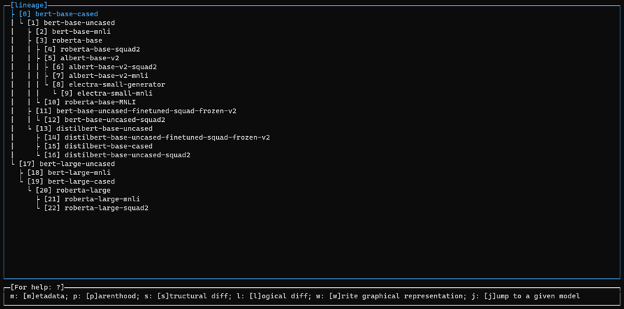
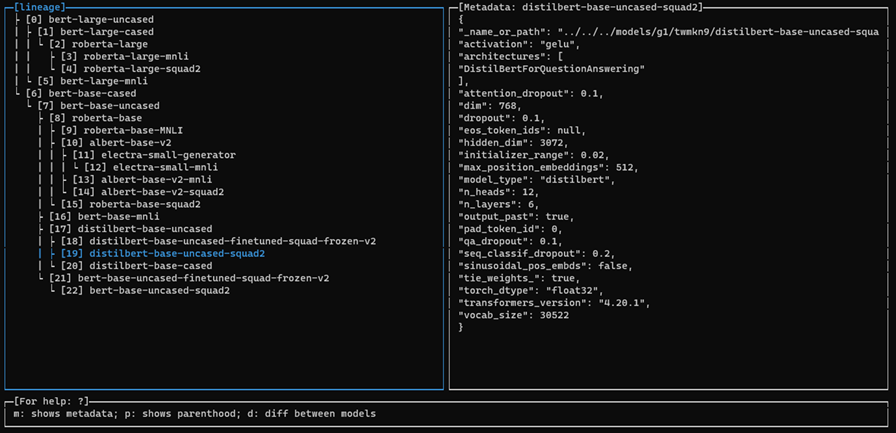
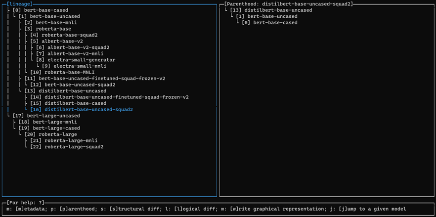
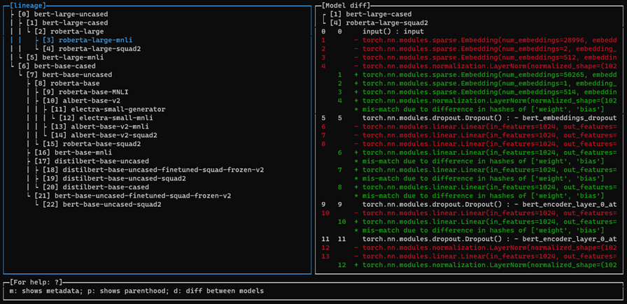
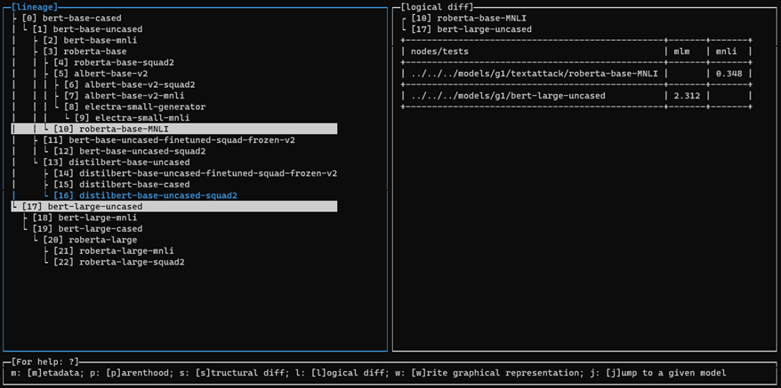
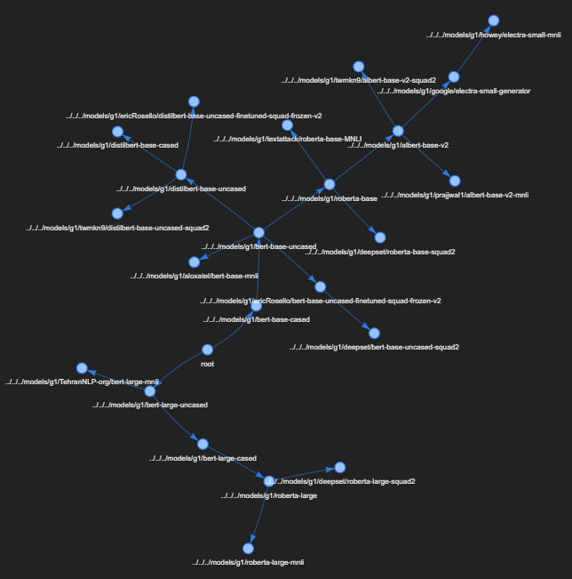

# MTig: Terminal-based Tool to Visualize the Lineage of Machine Learning Models

## Motivation

The lineage graphs created and managed by MGit can be complex, with a large
number of nodes and non-trivial connectivity. This can make it
difficult to build a mental model of the structure of a given graph.

To help with this, we developed a terminal-based tool, called MTig, that
supports the visualization of a lineage graph. In addition, MTig supports
several auxiliary graph operations, like showing parenthood, model metadata,
diffs between models, etc.

MTig is located at `<mgit directory>/mtig/`. Inside this directory, `mtig` is
started using:

```bash
bash mtig.sh <lineage graph> [metadata directory]
```

Assuming the lineage graph of the BERT model is in the current directory, 
and has an associated metadata file `lineage_graph-bert.json`, running
```bash
bash mtig.sh lineage_graph-bert.json
```
opens an MTig window, which shows a tree representation of the lineage
graph (in this example the BERT model) and a status bar with the commands
available. Using `UP` / `DOWN` keys, the user can select different models resulting
from versions / adaptations of the root model from the list. It is also possible
to select a model using its index (the number inside `[]`) by pressing `j` and
providing the model number in the input window at the bottom.



## Commands

Every command described in this section creates a new panel in the right side
of the window. Pressing `ESC` returns to the previous single panel view of the
lineage.

### Metadata: `m`

Pressing `m` shows the metadata of the selected model.



### Parenthood: `p`

Pressing `p` shows the parenthood of selected model.



### Structural Diff: `s`

Pressing `s` prompts for the index of two models (below in the status bar) and shows the
structural differences between them. This operation may take a while depending on the
size of the models.



### Logical Diff: `l`

Pressing `l` prompts for the index of two models (below in the status bar) and shows the
logical differences (i.e., differences in behavior) between them.



### Visual graph representation: `w`

Pressing `w` creates a file `<lineage graph>.html` with a figure (non-ASCII version) of the
graph representation of the full lineage graph.


